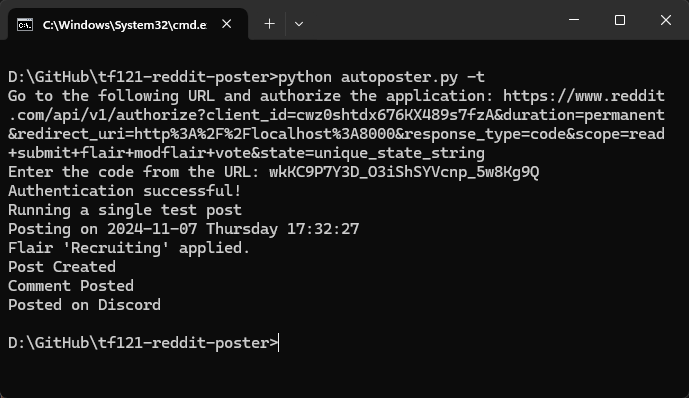

# Automated Recruiting Posts on Reddit
A Python script that automates recruiting posts for an Arma 3 unit on reddit. Creates a slideshow from a pool of promotional images with captions. Posts a comment with the informational pitch to the Reddit post. Lastly, posts the URL of the Reddit post in the unit discord for user upvotes.  
**[Check Past Reddit Posts](https://www.reddit.com/user/TaskForce121Online/)**

## Prerequisites
**Python Reddit API Wrapper (PRAW):** `pip install praw`  
**python-dotenv:** `pip install python-dotenv`  
**Schedule:** `pip install schedule`

*Setup an `.env` file with a Reddit App and a Discord Webhook as shown in `.env_format`, along with edits to the `config.txt` if you want to repurpose this script for your own reddit slideshow posts.*

